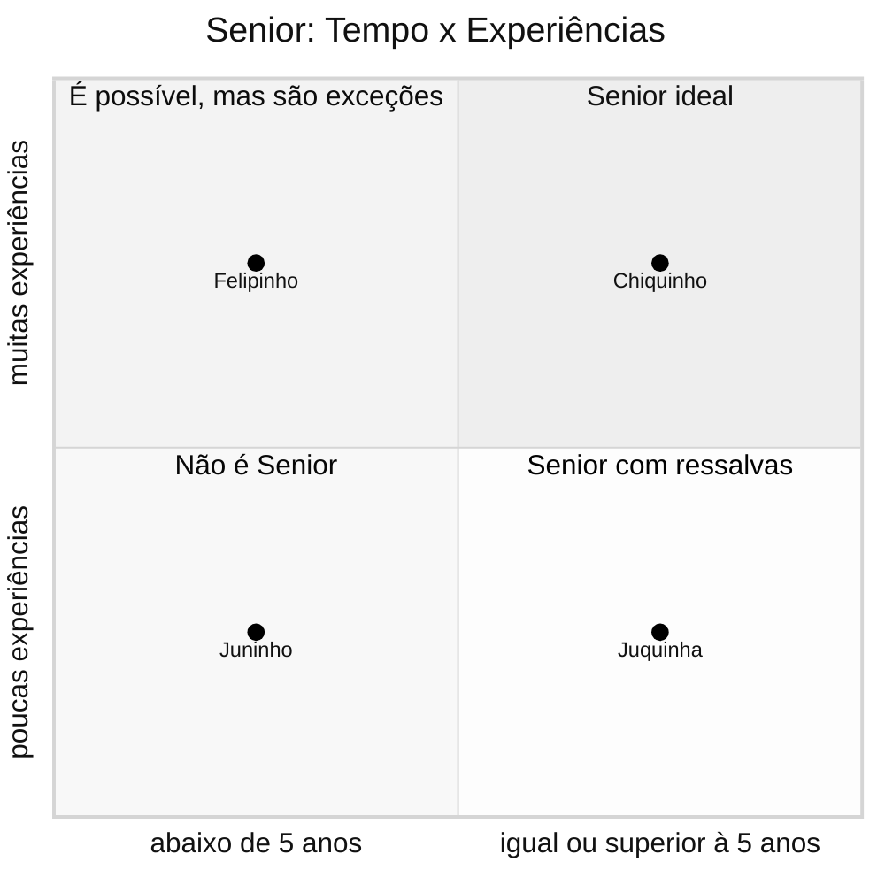

# Diagrama utilizado em publicação no TabNews

```mermaid
%%{init: {'theme':'neutral'}}%%
quadrantChart
    title Senior: Tempo x Experiências
    x-axis "abaixo de 5 anos" --> "igual ou superior à 5 anos"
    y-axis "poucas experiências" --> "muitas experiências"
    quadrant-1 "Senior ideal"
    quadrant-2 "É possível, mas são exceções"
    quadrant-3 "Não é Senior"
    quadrant-4 "Senior com ressalvas"
    Chiquinho: [0.75, 0.75]
    Juquinha: [0.75, 0.25]
    Juninho: [0.25, 0.25]
    Felipinho: [0.25, 0.75]
```