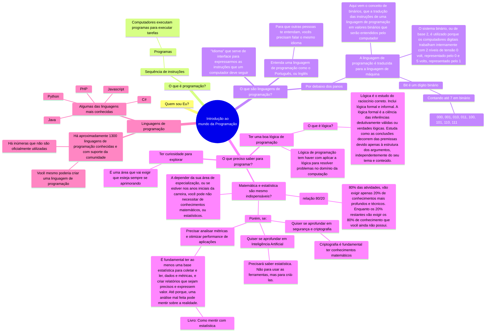

## Refs

* [CS50 - Introdução à ciência da computação](https://www.youtube.com/watch?v=SYZkrqW8oJc&list=PLRqGANMTmslTVwZA-H7aDiiNACau3yhVH)
* [Como mentir com estatística](https://www.amazon.com.br/Como-Mentir-Estat%C3%ADstica-Darrell-Huff/dp/858057952X)